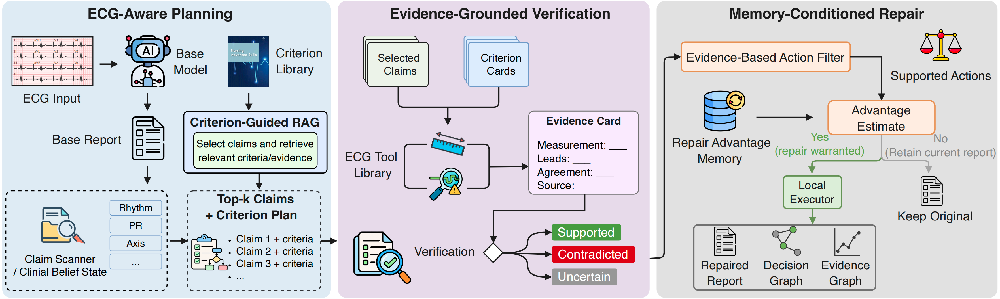

<div align="center">

# ECG-RePAIR

### From ECG evidence to selective report repair

**Criterion-guided verification · Repair advantage memory · Local report actions**

[](https://www.python.org/)
[](https://github.com/dragonlfy/ECG-RePAIR/actions/workflows/tests.yml)
[](#scope)

[Quick start](#quick-start) · [Workflow](#workflow) · [Your data](#run-on-your-own-reports) · [Architecture](docs/architecture.md) · [Data formats](docs/data-formats.md)

</div>

---

ECG-RePAIR revisits an initial ECG interpretation before accepting the final
report. It inspects individual claims, checks them against measurements from the
current waveform, and uses historical repair outcomes to decide whether a local
change is worthwhile. A finding can be supported by the ECG without automatically
being added to the report.

This repository contains the reusable implementation: an extensible Agent SDK,
clinical verification rules, ECG measurement tools, an evidence-conditioned ridge
advantage model, local report editing, evidence graphs, and passage retrieval.
Bring your own base-model reports, waveforms, and historical action outcomes.

## Workflow



| Component | What it contributes |
| :--- | :--- |
| **Claim verification** | Separates the original report assertion from `Supported`, `Contradicted`, and `Uncertain` waveform evidence. |
| **ECG tools** | Measures intervals, rate/rhythm, frontal axis, voltage, and morphology using calibrated signals and records agreement. |
| **Repair advantage memory** | Fits historical state–action outcomes; query-fold outcomes are excluded from fitting. |
| **Local execution** | Applies an eligible `Add` or `Revise`, or keeps the current diagnoses when no edit qualifies. |
| **Evidence graphs** | Links diagnoses to measurements and checks that evidence rendering preserves the repaired diagnosis set. |
| **Knowledge retrieval** | Searches a user-owned passage index with source/page provenance. Knowledge passages are separate from patient evidence. |

## Quick start

```bash
git clone https://github.com/dragonlfy/ECG-RePAIR.git
cd ECG-RePAIR
python -m venv .venv
source .venv/bin/activate
python -m pip install -e '.[dev]'

ecg-repair demo
python -m pytest
```

The demo runs the actual verifier, ridge advantage model, local composer, and
graph renderer on **fabricated observations and historical rewards**. It needs
no dataset, network service, model checkpoint, or GPU. It demonstrates the API;
it is not a clinical example or a benchmark result.

For an even smaller example of interchangeable SDK components:

```bash
python examples/quickstart.py
```

## Run on your own reports

### 1. Measure the waveform

Install the optional signal-processing packages:

```bash
python -m pip install -e '.[ecg]'
ecg-repair measure data/example.npz --output outputs/instruments.jsonl
```

Signals must have shape **`(12, samples)`**, amplitudes in **mV**, and a known
sampling rate. The canonical lead order is
`I, II, III, aVR, aVL, aVF, V1, V2, V3, V4, V5, V6`.
See [data formats](docs/data-formats.md) for converting arrays or WFDB records.
Measurement uses NeuroKit2 and WFDB/XQRS plus the included axis, voltage, and
morphology routines. Failed or disputed measurements remain unavailable to the
verifier; they are not replaced with normal values.

### 2. Supply reports and historical outcomes

Each query report is one JSON object per line:

```json
{"record_id":"example-001","fold":0,"report":"<answer>Sinus rhythm</answer>","labels":["sinus rhythm"]}
```

The memory file contains historical claim/action observations and their measured
report-score changes. Its schema is described in [data formats](docs/data-formats.md#historical-memory).
The query ECG's reference report or judge score is never an inference input.

### 3. Run repair

```bash
ecg-repair repair \
  --reports data/reports.jsonl \
  --instruments outputs/instruments.jsonl \
  --memory data/historical_outcomes.jsonl \
  --base-model-id ECG-R1 \
  --alpha 100 --margin 2 \
  --output outputs/repaired.jsonl
```

For each query fold, the command fits memory using the other folds and rejects
overlapping query record IDs in usable memory. It returns the base/final reports,
measurements, action decisions, trace, and audit results. Without `--memory`,
diagnostic edits are not authorized; evidence rendering may still annotate
already retained diagnoses. Existing output files are never overwritten.

## Retrieval

The clinical registry and verifier provide executable criteria. The optional
text retrieval module searches passages supplied by the user:

```bash
ecg-repair retrieve \
  --index data/knowledge.jsonl \
  --query "PR interval measurement and first-degree AV block" \
  --top-k 3
```

The release includes TF-IDF retrieval and the `ClinicalCriterionRAG` graph
integration API. External textbook retrieval is **not automatically called by
the `repair` CLI**; connect it explicitly if needed. See
[knowledge sources](docs/knowledge.md) for source attribution, indexing, and the
distinction between retrieved text and an executable clinical rule.

## Extend the framework

Replace a component without rewriting the rest of the Agent:

| Interface | Example extension |
| :--- | :--- |
| `BaseECGModel` | Integrate a new ECG reporting model or read its stored outputs. |
| `ClaimScanner` / `InspectionPlanner` | Improve claim extraction or inspection priority. |
| `ECGExpert` / `ClinicalVerifier` | Add measurements and verification criteria. |
| `OutcomePolicy` | Study another action-value estimator. |
| `ReportComposer` / `EvidencePresenter` | Change local editing or evidence presentation. |

The typed contracts live in `src/ecg_framework/protocols.py`.
[Architecture](docs/architecture.md) explains the execution contract and
[plugin_template.py](examples/plugin_template.py) shows an extension skeleton.

## Repository map

```text
src/
├── ecg_repair/       # Public CLI, input validation, measurement and repair entry points
├── ecg_framework/    # Typed Agent SDK, runtime, audit, and adapters
├── ecg_agent/        # Clinical registry, verification, advantage model, and local edits
├── ecgcf/           # Calibrated ECG I/O, measurement routines, synthetic test generator
└── harness/         # Minimal negation-aware concept matching used by the composer
examples/            # Network-free examples and extension template
tests/               # Synthetic/unit tests; no patient data
docs/                # Architecture, input schemas, knowledge and release scope
```

## Scope

This is a **code release for research**, not a clinical diagnostic product.
It contains no patient waveforms, real reports, reference interpretations,
expert annotations, model weights, credentials, or manuscript files. Obtain
datasets and base models through their original access procedures.

The portable entry point uses the existing verification, ridge, editing, and
rendering components. It exposes one bounded inspection/repair pass with explicit
hyperparameters. It does not include the private cached core/expansion experiment
orchestration or the fitted study memories, and running the demo does not
reproduce a paper score. See [release scope](docs/release-scope.md) for details.

## Development

```bash
python -m pip install -e '.[dev]'
python -m pytest
python -m build
```

CI checks the core package on Python 3.10 and 3.12. Real-waveform validation
requires the optional ECG dependencies and separately obtained data.

## Acknowledgements

ECG measurement builds on [NeuroKit2](https://github.com/neuropsychology/NeuroKit)
and [WFDB](https://github.com/MIT-LCP/wfdb-python). Please cite the relevant
software, datasets, and base models in work built on this repository.
Source attribution and licensing notes are in [NOTICE.md](NOTICE.md).
